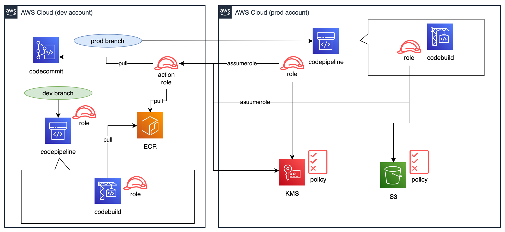

# Description

codecommit でリポジトリを管理し、ブランチで環境を分けて、クロスアカウントが必要な場合のデプロイパイプラインを構築する。

# Situation

- Golang、SAM で構築されたサーバーレス構成のデプロイ。
- 開発環境にリポジトリがあり、本番環境にデプロイするクロスアカウントアクセスが必要。
- codebuild ではカスタム Docker イメージやテストのための DB の Docker イメージ を 開発環境の ECR から pull する必要がある。

# Operation

1. dev/pipeline.yaml
2. prod/prepare.yaml
3. dev/actionrole.yaml
4. prod/pipeline.yaml

# Architecture

# Note

- 各種ロールの権限・principal は大雑把に設定しているため利用時は詳細に設定されたい。
- pipeline 構築時、codebuild の golang117 のランタイムイメージが無かったためカスタムイメージを使用している。
  - 現状、golang118 がある模様(https://docs.aws.amazon.com/ja_jp/codebuild/latest/userguide/runtime-versions.html)。
